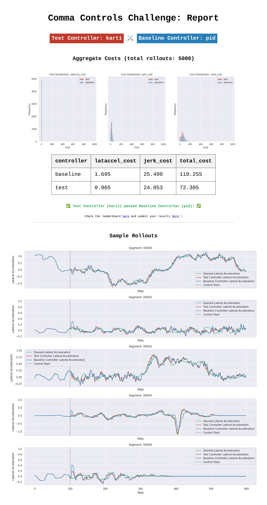

# comma-controls-challenge

A real-time controller for the [comma controls challenge](https://github.com/commaai/controls_challenge): keep the simulated car on its target lateral-acceleration trajectory without sawing the wheel.

**`total_cost` 72.3 vs the pid baseline's 110.3 — 34% lower, and better on both axes.** Scored on the full 5,000-segment set.



| controller | total_cost | lataccel_cost | jerk_cost |
| --- | --- | --- | --- |
| **`karti`** | **72.3** | **0.97** | **24.1** |
| `pid` (baseline) | 110.3 | 1.70 | 25.5 |

## How it works

Feedforward does the driving. PID just trims the residual.

Most of the steer command is a static inverse-model — desired lateral accel → steering:

```
steer = k1·net + k2·net·v + k3·net·v²        net = target_lataccel − road_roll_lataccel
```

Three things, in the order I learned them:

**1. Fit the feedforward to the *sim*, not the car.**
First I fit that map on the real comma-steering-control logs. Clean fit (R² ≈ 0.86) — and it made things *worse*. TinyPhysics' steer→lataccel gain isn't the real car's. So I dropped the logs, ran `pid`, recorded what lataccel the *simulator* actually returns for each steer, and fit on that. Gap closed. (`analysis/fit_ff_sim.py`)

**2. The jerk came from the feedforward, not the feedback.**
A raw inverse-model tracks well but pipes step-to-step state noise (roll, v) straight to the wheel — `lataccel_cost` drops, `jerk_cost` jumps. The fix isn't a low-pass on the output (that just adds lag). It's to feed the model the target **averaged over the next 8 steps of the future plan**: a *zero-lag* smoother. It previews the trajectory (kills tracking lag) and smooths the command (kills the injected jerk) at the same time. Both costs fall.

**3. Don't reach for more feedback.**
With a 50× weight on `lataccel_cost`, the temptation is to crank the gains. Don't — feedback is the *source* of the jerk here; stronger PID makes it explode. The stock baseline gains (`0.195 / 0.10 / −0.053`) turned out optimal once the feedforward was carrying the load.

## Run it

`karti.py` is a drop-in controller. Put it in `controllers/` inside a checkout of [commaai/controls_challenge](https://github.com/commaai/controls_challenge):

```bash
python eval.py --model_path ./models/tinyphysics.onnx --data_path ./data \
  --num_segs 5000 --test_controller karti --baseline_controller pid
```

`analysis/` is the offline work, meant to run from inside that same checkout:
`fit_ff_sim.py` (the sim-calibrated fit), `tune.py` (coordinate descent), `diag*.py` (the cost-breakdown sweeps that found the jerk source), `validate.py` (held-out check).

## What didn't work

- **Backward EMA** on roll or on the output — phase lag, worse tracking. The future plan hands you a zero-lag smoother; use that instead.
- **Stronger feedback** — `jerk_cost` blows up.
- **The fitted constant offset** — a steady steering bias that hurt tracking. Dropped.

## Where this sits

72 is the honest middle. The top of the leaderboard (~7) is per-segment offline action optimization — not a real-time controller. The clear path lower from here is receding-horizon MPC over a learned 1-step dynamics surrogate, targeting sub-20 while staying causal. The feedforward + PID story was the one worth shipping first.

---

Solution to the [comma controls challenge](https://github.com/commaai/controls_challenge). MIT.
